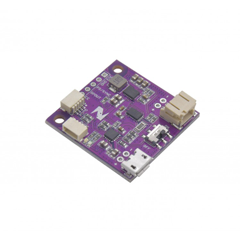

# Zio LiPo Battery Manager (Single battery)

> This product can be available for purchase [here](https://www.smart-prototyping.com/Zio-LiPo-Battery-Manager.html).

#### Description

This board combines a lithium polymer battery charger, fuel gauge, and voltage regulator, all in one neat little PCB. It also features a miniature DPDT power switch so that you can easily turn your project on and off without disconnecting the battery.

The Battery Manager’s TI BQ27441-G1A I2C Fuel Gauge is a Coulomb-counter, tracking the amount of power that has been discharged since your battery was fully charged. The amount of power remaining is calculated based on the capacity of that battery that you’ve set via the [Sparkfun BQ27441-G1 I2C library](https://learn.sparkfun.com/tutorials/battery-babysitter-hookup-guide#bq27441-arduino-library). Using the library, you can also read the raw voltage of your LiPo battery’s output. And because this is a Qwiic device, your MCU can check this information even if your battery and Battery Manager board are all the way at the other end of your daisy-chain of Qwiic modules. And if your Power Module is close to your MCU, just connect the GPOUT interrupt pin to one of your MCU’s GPIO pins to get a heads-up when the tank is running low. And because of the built-in current-sensing resistor circuit, you can even measure your project’s real-time current consumption.

The Battery Manager’s BQ24075 battery charger IC can charge your single-cell lithium-ion battery pack at up to 1.5A.

Our Battery Manager board is based on [Sparkfun’s Battery Babysitter](https://www.sparkfun.com/products/13777), and while the pin-out isn’t exactly the same, their [Hookup Guide](https://learn.sparkfun.com/tutorials/battery-babysitter-hookup-guide) is a great resource for getting started with our board as well.

Note: This board requires the use of the Qwiic (4-pin JST-SH) connector for accessing the I2C functionality of the BQ27441-G1A. If you intend to use this board in a project where your MCU doesn’t include a Qwiic connector, make sure you pick up a [Qwiic-to-breadboard cable](https://www.smart-prototyping.com/Prototyping-Modules/zio/Qwiic-to-Breadboard-Male-Header-150mm-Cable-2.54mm-10pcs), or any [Qwiic cable](https://www.smart-prototyping.com/index.php?route=product/search&search=qwiic%20cable) and a [Qwiic adapter board](https://www.smart-prototyping.com/Prototyping-Modules/zio/Zio-Qwiic-Adapter.html).

##### Features

* Protects the battery from running outside the safe operating area.
* Easy to connect to any ZIO products with one simple Qwiic cable.
* Features a dynamic power-path management which will maintain a solid output supply of 3.3V
* Contains a safety timer which will turn off the charger after 6.25 hours.

#### Specification

* Input Voltage- 6V max
* Output Voltage- 3.3V
* Output current- 1.5A max
* Qwiic connectors 3.3v and 1.5A max
* Battery Connector: PH Connector
* Battery Charger IC: BQ24075
* Power Manager IC: TPS63020DSJR
* Battery Gauge IC: BQ27441-G1
* I2C address:0x55
* Dimensions: 32.23x 33.24 mm
* Weight: 4.9g

#### Links

* [Eagle files](https://github.com/ZIOCC/Zio-LiPo-Battery-Manager-single-battery/tree/master/EAGLE)

> ###### About Zio
> Zio is a new line of open sourced, compact, and grid layout boards, fully integrated for Arduino and Qwiic ecosystem. Designed ideally for wearables, robotics, small-space limitations or other on the go projects. Check out other awesome Zio products [here](https://www.smart-prototyping.com/Zio).
